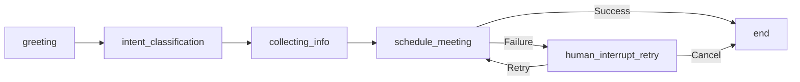

# 🔄 State Progression in MeetingMuse

## Overview

This document illustrates how the conversation state evolves as MeetingMuse interacts with users to schedule meetings, including the new human-in-the-loop retry flow with dedicated nodes for API calls and human interruption handling.

## 📊 State Structure

The core state object contains the following key components:

| Field | Type | Description |
|-------|------|-------------|
| `messages` | `List[Message]` | Complete conversation history |
| `user_intent` | `str \| None` | Classified user intention |
| `meeting_details` | `dict` | Collected meeting information |

## 🏗️ Graph Routing Implementation

The current graph implements the following routing flow:

```
START -> Classify Intent -> [Greeting|Collecting Info|Clarify Request]
                             ↓
Collecting Info (loop until complete) -> Schedule Meeting (SCHEDULE_MEETING)
                                              ↓
                                    ✅ success → END
                                    ❌ failure → Human Interrupt Retry
                                                        ↓
                                              retry → SCHEDULE_MEETING (loop)
                                              cancel → END
```

### Key Routing Logic:

1. **`collecting_info_node.get_next_node_name()`**: Returns `NodeName.SCHEDULE_MEETING` when meeting details are complete
2. **Command-based routing**: Schedule Meeting and Human Interrupt Retry nodes use `Command(goto=...)` for navigation
3. **Human Interrupt Retry**: Uses LangGraph's `interrupt()` function for user decisions and routes via:
   - `Command(goto="schedule_meeting")` for retry
   - `Command(goto="end")` for cancel

## 🎯 State Evolution Examples

### 1. Initial State (Conversation Starts)

When a user first interacts with MeetingMuse:

```json
{
  "messages": [
    {
      "role": "human",
      "content": "Hi, I want to schedule a meeting"
    }
  ],
  "user_intent": null,
  "meeting_details": {}
}
```

**Key Points:**
- ✅ User message captured
- ❓ Intent not yet classified
- 🚀 Workflow starting
- 📝 No meeting details collected
- 🔌 No API calls attempted

---

### 2. After Intent Classification

Once the system processes the user's intent:

```json
{
  "messages": [
    {
      "role": "human",
      "content": "Hi, I want to schedule a meeting"
    }
  ],
  "user_intent": "schedule",
  "meeting_details": {},
  "schedule_meeting_status": null,
  "api_error_message": null
}
```

**Key Changes:**
- 🎯 **Intent identified**: `"schedule"`
- 📋 **Ready for**: Information collection
- 🔄 **API status**: Not yet attempted

---

### 3. After API Call Success

When the meeting is successfully scheduled:

```json
{
  "messages": [
    {
      "role": "human",
      "content": "Hi, I want to schedule a meeting"
    },
    {
      "role": "assistant",
      "content": "Great! What's the meeting about?"
    },
    {
      "role": "human",
      "content": "Team standup for tomorrow at 2pm"
    },
    {
      "role": "assistant",
      "content": "✅ Meeting scheduled successfully! Meeting ID: MTG_1234. Title: Team standup, Time: tomorrow at 2pm"
    }
  ],
  "user_intent": "schedule",
  "meeting_details": {
    "title": "Team standup",
    "date_time": "tomorrow at 2pm",
    "duration": null,
    "participants": null
  },
  "schedule_meeting_status": "success",
  "api_error_message": null
}
```

**Workflow Complete:**
- ✅ **API call successful**: Meeting created
- 🎯 **Status**: "success"
- 🏁 **Next**: END node

---

### 4. After API Call Failure

When the meeting scheduling fails:

```json
{
  "messages": [
    {
      "role": "human",
      "content": "Hi, I want to schedule a meeting"
    },
    {
      "role": "assistant",
      "content": "Great! What's the meeting about?"
    },
    {
      "role": "human",
      "content": "Team standup for tomorrow at 2pm"
    },
    {
      "role": "assistant",
      "content": "❌ Failed to schedule meeting: Calendar service temporarily unavailable. Please try again."
    }
  ],
  "user_intent": "schedule",
  "meeting_details": {
    "title": "Team standup",
    "date_time": "tomorrow at 2pm",
    "duration": null,
    "participants": null
  },
  "schedule_meeting_status": "failed",
  "api_error_message": "Calendar service temporarily unavailable. Please try again."
}
```

**Requires Human Decision:**
- ❌ **API call failed**: Error occurred
- 🤔 **Next**: Human Interrupt Retry node
- � **Options**: Retry or Cancel

---

### 5. After Human Retry Decision

When user chooses to retry:

```json
{
  "messages": [
    // ... previous messages ...
    {
      "role": "assistant",
      "content": "User chose to retry. Attempting again..."
    }
  ],
  "user_intent": "schedule",
  "meeting_details": {
    "title": "Team standup",
    "date_time": "tomorrow at 2pm",
    "duration": null,
    "participants": null
  },
}
```

**Retry Flow:**
- 🔄 **User choice**: Retry
- 🧹 **Status cleared**: Ready for new attempt
- ➡️ **Next**: Back to Schedule Meeting node via `Command(goto="schedule_meeting")`

When user chooses to cancel:

```json
{
  "messages": [
    // ... previous messages ...
    {
      "role": "assistant",
      "content": "User chose to cancel. Operation ended."
    }
  ],
  "user_intent": "schedule",
  "meeting_details": {
    "title": "Team standup",
    "date_time": "tomorrow at 2pm",
    "duration": null,
    "participants": null
  },
  "schedule_meeting_status": "failed",
  "api_error_message": "Calendar service temporarily unavailable. Please try again.",
}
```

**Cancel Flow:**
- ❌ **User choice**: Cancel
- 🏁 **Operation**: Terminated
- ➡️ **Next**: End workflow via `Command(goto="end")`

---

## 🔄 Workflow Stages

### Stage Flow



### Stage Descriptions

| Stage | Purpose | Expected Input | Next Action |
|-------|---------|----------------|-------------|
| `greeting` | Initial user contact | Any user message | Classify intent |
| `intent_classification` | Determine user goal | User intent signals | Route to appropriate handler |
| `collecting_info` | Gather meeting details | Meeting parameters | Validate completeness |
| `schedule_meeting` | Schedule meeting via API | Complete meeting data | Success -> END, Failure -> Retry |
| `human_interrupt_retry` | Handle API failures | User retry decision | Retry -> API call, Cancel -> END |
| `end` | Complete workflow | Final confirmation | Workflow finished |

## 🎨 Visual State Progression

```
┌─────────────────┐    ┌─────────────────┐    ┌─────────────────┐    ┌─────────────────┐
│   Initial       │    │   Intent        │    │   API Call      │    │   Success/      │
│   Contact       │───▶│   Classified    │───▶│   Attempted     │───▶│   Retry Flow    │
│                 │    │                 │    │                 │    │                 │
│ 🙋 User says hi │    │ 🎯 Want to      │    │ � Schedule     │    │ ✅ Success->END │
│ ❓ Intent: null │    │    schedule     │    │    meeting      │    │ ❌ Fail->Retry  │
│ 🚀 Workflow     │    │ 📋 Collect info │    │ 🤞 API call    │    │ 🔄 User choice  │
│    starting     │    │                 │    │                 │    │                 │
└─────────────────┘    └─────────────────┘    └─────────────────┘    └─────────────────┘
```

## 🛠️ Implementation Notes

### State Management Best Practices

1. **Immutability**: Always create new state objects rather than mutating existing ones
2. **Validation**: Validate state transitions to prevent invalid flows
3. **Persistence**: Consider persisting state for long-running conversations
4. **Error Handling**: Gracefully handle incomplete or invalid state

### Testing the Human Interrupt Retry Flow

The `HumanInterruptRetryNode` includes comprehensive test coverage for:

- **Retry approval**: Tests when user chooses to retry the operation
- **Cancel approval**: Tests when user chooses to cancel the operation
- **State preservation**: Ensures existing state is maintained during retry flow
- **Interrupt parameters**: Validates the structure of interrupt calls
- **Command routing**: Verifies correct `Command(goto=...)` routing

**Running the tests:**
```bash
# Run all tests
make test

# Run specific human interrupt retry tests
poetry run pytest tests/meetingmuse/nodes/test_human_interrupt_retry_node.py -v
```

Key test scenarios:
```python
# Test retry flow
@patch('meetingmuse.nodes.human_interrupt_retry_node.interrupt')
def test_retry_approval_true(self, mock_interrupt):
    mock_interrupt.return_value = True
    result = self.node.node_action(self.base_state)
    assert result.goto == "schedule_meeting"

# Test cancel flow
@patch('meetingmuse.nodes.human_interrupt_retry_node.interrupt')
def test_retry_approval_false(self, mock_interrupt):
    mock_interrupt.return_value = False
    result = self.node.node_action(self.base_state)
    assert result.goto == "end"
```

### Example State Validation

```python
def validate_state_transition(current_state, new_state):
    """Ensure state transitions are valid."""
    valid_transitions = {
        "greeting": ["intent_classification"],
        "intent_classification": ["collecting_info"],
        "collecting_info": ["schedule_meeting"],
        "schedule_meeting": ["end", "human_interrupt_retry"],
        "human_interrupt_retry": ["schedule_meeting", "end"],
        "end": ["greeting"]  # For new conversations
    }

    # Note: Since we removed current_step, this validation would need
    # to be adapted to use other state indicators like schedule_meeting_status
    # or the presence of certain fields to determine current stage

    return True  # Simplified for this example
```

---

## 📚 Related Documentation

- [Graph Architecture](./graph_architecture.md)
- [Node Implementations](./nodes.md)
- [Message Handling](./messages.md)
- [API Reference](./api.md)

---

*Last updated: July 26, 2025*
