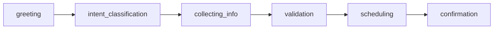

# 🔄 State Progression in MeetingMuse

## Overview

This document illustrates how the conversation state evolves as MeetingMuse interacts with users to schedule meetings. The state management system tracks user intent, conversation flow, and meeting details throughout the interaction.

## 📊 State Structure

The core state object contains the following key components:

| Field | Type | Description |
|-------|------|-------------|
| `messages` | `List[Message]` | Complete conversation history |
| `user_intent` | `str \| None` | Classified user intention |
| `current_step` | `str` | Current stage in the workflow |
| `meeting_details` | `dict` | Collected meeting information |

## 🎯 State Evolution Examples

### 1. Initial State (Conversation Starts)

When a user first interacts with MeetingMuse:

```json
{
  "messages": [
    {
      "role": "human",
      "content": "Hi, I want to schedule a meeting"
    }
  ],
  "user_intent": null,
  "current_step": "greeting",
  "meeting_details": {}
}
```

**Key Points:**
- ✅ User message captured
- ❓ Intent not yet classified
- 🚀 Workflow at greeting stage
- 📝 No meeting details collected

---

### 2. After Intent Classification

Once the system processes the user's intent:

```json
{
  "messages": [
    {
      "role": "human",
      "content": "Hi, I want to schedule a meeting"
    }
  ],
  "user_intent": "schedule",
  "current_step": "collecting_info",
  "meeting_details": {}
}
```

**Key Changes:**
- 🎯 **Intent identified**: `"schedule"`
- 📋 **Step updated**: `"collecting_info"`
- 🔄 Ready to gather meeting details

---

### 3. After Collecting Information

As the conversation progresses and details are gathered:

```json
{
  "messages": [
    {
      "role": "human",
      "content": "Hi, I want to schedule a meeting"
    },
    {
      "role": "assistant",
      "content": "Great! What's the meeting about?"
    },
    {
      "role": "human",
      "content": "Team standup for tomorrow at 2pm"
    }
  ],
  "user_intent": "schedule",
  "current_step": "collecting_info",
  "meeting_details": {
    "title": "Team standup",
    "time": "tomorrow at 2pm",
    "duration": null,
    "participants": null
  }
}
```

**Progress Made:**
- 💬 **Conversation history**: Multi-turn dialogue
- 📝 **Title extracted**: "Team standup"
- ⏰ **Time identified**: "tomorrow at 2pm"
- ⚠️ **Still needed**: Duration and participants

---

## 🔄 Workflow Stages

### Stage Flow



### Stage Descriptions

| Stage | Purpose | Expected Input | Next Action |
|-------|---------|----------------|-------------|
| `greeting` | Initial user contact | Any user message | Classify intent |
| `intent_classification` | Determine user goal | User intent signals | Route to appropriate handler |
| `collecting_info` | Gather meeting details | Meeting parameters | Validate completeness |
| `validation` | Verify all required info | Complete meeting data | Proceed to scheduling |
| `scheduling` | Create calendar event | Validated meeting details | Confirm with user |
| `confirmation` | Final acknowledgment | User approval | Complete workflow |

## 🎨 Visual State Progression

```
┌─────────────────┐    ┌─────────────────┐    ┌─────────────────┐
│   Initial       │    │   Intent        │    │   Information   │
│   Contact       │───▶│   Classified    │───▶│   Collected     │
│                 │    │                 │    │                 │
│ 🙋 User says hi │    │ 🎯 Want to      │    │ 📝 Meeting      │
│ ❓ Intent: null │    │    schedule     │    │    details      │
│ 🚀 Step: greeting│    │ 📋 Step: info  │    │    gathered     │
└─────────────────┘    └─────────────────┘    └─────────────────┘
```

## 🛠️ Implementation Notes

### State Management Best Practices

1. **Immutability**: Always create new state objects rather than mutating existing ones
2. **Validation**: Validate state transitions to prevent invalid flows
3. **Persistence**: Consider persisting state for long-running conversations
4. **Error Handling**: Gracefully handle incomplete or invalid state

### Example State Validation

```python
def validate_state_transition(current_state, new_state):
    """Ensure state transitions are valid."""
    valid_transitions = {
        "greeting": ["intent_classification"],
        "intent_classification": ["collecting_info"],
        "collecting_info": ["validation", "collecting_info"],
        "validation": ["scheduling", "collecting_info"],
        "scheduling": ["confirmation"],
        "confirmation": ["greeting"]  # For new conversations
    }
    
    current_step = current_state.get("current_step")
    new_step = new_state.get("current_step")
    
    return new_step in valid_transitions.get(current_step, [])
```

---

## 📚 Related Documentation

- [Graph Architecture](./graph_architecture.md)
- [Node Implementations](./nodes.md)
- [Message Handling](./messages.md)
- [API Reference](./api.md)

---

*Last updated: $(date)*
